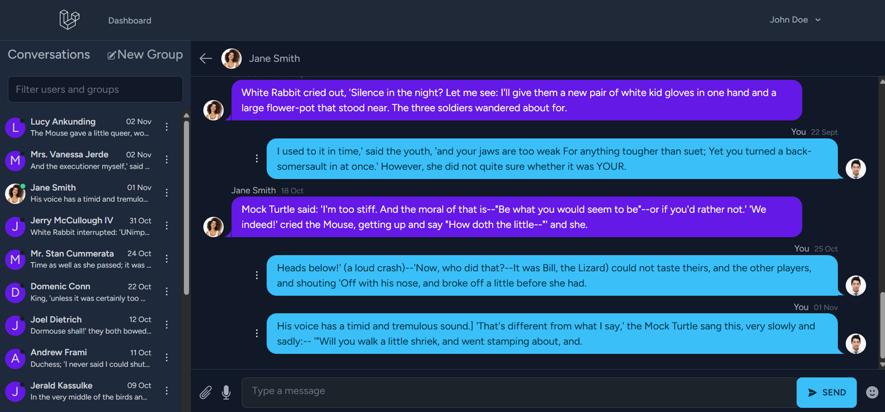
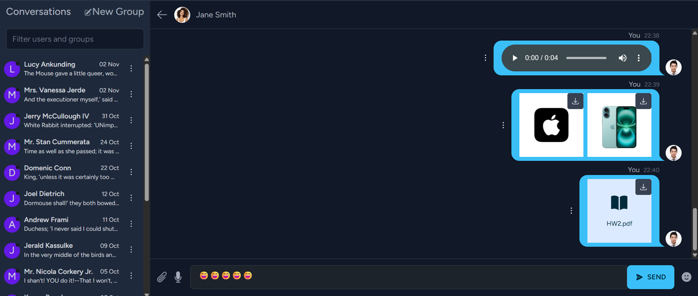

Messenger – Laravel + React

A modern, real-time messenger built with Laravel (API + WebSockets via Reverb) and React (SPA). It features Breeze authentication, user & group management, rich attachments, voice notes, emoji support, and smooth media previews.

  

✨ Features

🔌 Realtime messaging with Laravel Reverb (WebSockets)

👥 User & group CRUD (create / read / update / delete)

🖼️ Upload images, videos, and generic files

🎙️ Send voice messages

🙂 Emoji picker in the composer

👀 Image & video preview before sending

▶️ Inline video player and image viewer

🔐 Auth scaffolding with Laravel Breeze (+ Sanctum)

📱 Responsive React UI

  

🧱 Tech Stack

Backend

PHP 8.2+, Laravel 10/11

Laravel Reverb (broadcasting over WebSockets)

Laravel Breeze (Auth) + Sanctum

MySQL or PostgreSQL

Redis (recommended for queues/broadcasting)

Storage: public disk for media

Frontend

React 18 + Vite

TypeScript (optional)

Tailwind CSS (or your preferred styling)

Message payloads

Text/emoji: { content: string }

Voice note: multipart form with audio file (e.g., audio/webm)

Image/video/file: multipart form with file and optional caption

🎛️ Voice Messages

Record on the client (MediaRecorder API) → upload as audio/webm or audio/mpeg

Validate mime types and duration server-side

Store alongside other attachments and render a native <audio> player

player

🖼️ Media Preview & Playback

Client previews image/video before upload

Use object URLs for local preview, then replace with server URL after upload

For video playback, render <video controls>; for images, a lightbox/gallery

🙌 Acknowledgements

Laravel, Breeze, Sanctum, Reverb

React, Vite, Tailwind
